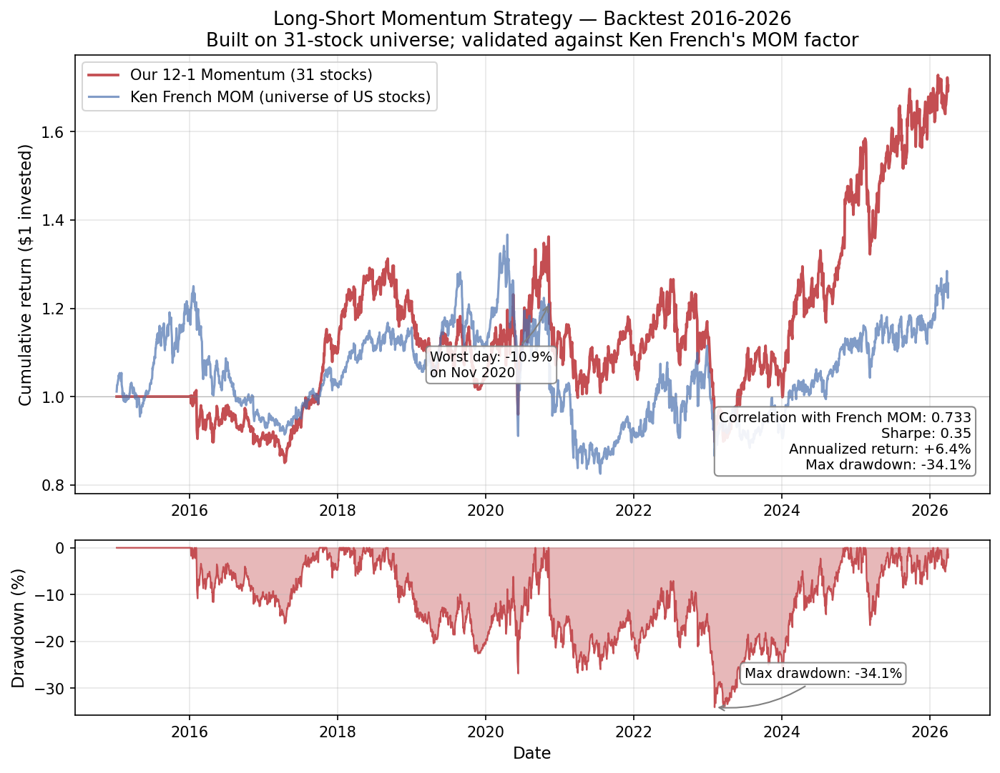

# Multi-Factor Equity Model with Fama-MacBeth and Momentum Backtest

An empirical implementation of the Fama-French factor model, the Fama-MacBeth cross-sectional procedure, and a long-short momentum strategy on US large-cap equities. Built as the third project in a quantitative finance portfolio.

The implementation reproduces canonical results from the empirical asset pricing literature, identifies and corrects for the small-universe errors-in-variables problem in Fama-MacBeth, and validates a from-scratch momentum strategy against Ken French's published factor library at 0.73 correlation.

## Highlights

- **Two-pass Fama-French + Momentum regressions** on 31 large-cap US stocks (2015-2026) using Newey-West HAC standard errors
- **Fama-MacBeth procedure implemented both ways** — on individual stocks (where the small-universe pathology is exposed) and on sorted portfolios (where the market premium converges to within 0.6% of the raw factor return)
- **12-1 long-short momentum strategy** with 0.73 correlation to Ken French's MOM factor, 0.35 Sharpe, and the characteristic momentum-crash drawdown profile
- **Tests cover look-ahead bias detection, weight dollar-neutrality, and structural sanity checks** — 15 passing tests

---

## Momentum Strategy Backtest



Cumulative returns of the long-short 12-1 momentum strategy (red) against Ken French's MOM factor (blue). The 0.733 correlation confirms the construction captures the same underlying factor, despite our universe being 31 stocks versus French's thousands.

Key observations baked into the chart:

- **2016 momentum crash**: ~12-month drawdown period in 2016-2017 visible in both series; this is the well-documented sector rotation that crushed traditional momentum.
- **November 2020 worst day (-10.9%)**: a single-day loss when the Pfizer vaccine announcement triggered a violent rotation against high-momentum tech and into beaten-down value/cyclicals. This is the kind of episode Daniel & Moskowitz (2016) called "momentum crash dynamics following extreme market regimes."
- **Post-2023 outperformance vs. French**: our 31-stock universe is concentrated in mega-cap tech, which has been the dominant momentum theme since 2023. This is primarily a universe-selection effect, not pure alpha — see Limitations.
- **Max drawdown of -34%**: consistent with the typical 30-50% range for vanilla momentum.

---

## Methodology

### Step 1: Time-series regressions (factor exposures)

For each stock, we regress its excess returns on the Fama-French + Momentum factors:

```
R_i - R_f = α_i + β_i × (Mkt-RF) + s_i × SMB + h_i × HML + m_i × MOM + ε_i
```

Standard errors are Newey-West HAC with `maxlags=5`, the standard correction for autocorrelation and heteroskedasticity in daily return residuals.

**Results across 31 stocks:**
- Median R² = 0.44 (factors explain ~44% of typical stock variation)
- 31 of 31 stocks have statistically significant market β (|t| > 2)
- Only 1 of 31 stocks (NVDA, t=4.13) has statistically significant α — and even that should be discounted for multiple testing and survivorship bias

Sample exposures (sorted by R²):

| Ticker | R² | β | s | h | m |
|---|---|---|---|---|---|
| BAC | 0.74 | 1.25 | -0.04 | +1.03 | -0.11 |
| JPM | 0.73 | 1.14 | -0.17 | +0.86 | -0.05 |
| MSFT | 0.68 | 1.17 | -0.42 | -0.44 | +0.05 |
| AAPL | 0.59 | 1.18 | -0.31 | -0.35 | +0.01 |
| NVDA | 0.51 | 1.70 | +0.05 | -0.88 | +0.21 |
| KO | 0.34 | 0.55 | -0.42 | +0.22 | -0.07 |

Banks load heavily on the market and value factors. Mega-cap tech shows strong negative HML loadings (growth profile). Defensives have low β and weak factor explanation.

### Step 2: Fama-MacBeth cross-sectional regressions (factor risk premia)

For each of 2,826 daily cross-sections, we regress that day's stock returns on the (fixed) factor exposures. The factor risk premium estimate is the time-series average of the daily cross-sectional slopes; standard errors come from time-series variation.

**Two implementations:**

| Premium | Individual stocks (N=31) | Sorted portfolios (N=8) | Raw factor avg |
|---|---|---|---|
| λ_mkt | +18.0% (t=2.0) | **+11.0% (t=0.7)** | +11.6% |
| λ_smb | +2.0% (t=0.2) | +5.9% (t=0.2) | -1.7% |
| λ_hml | -4.9% (t=-0.9) | -8.4% (t=-1.1) | -0.7% |
| λ_mom | +51.6% (t=2.9) | not estimated | +3.6% |

The individual-stock estimate of λ_mom is inflated 15× over the raw factor return. The portfolio implementation recovers the market premium to within 0.6% of the raw factor average — see the "What I Learned" section below for the diagnosis.

### Step 3: Long-short momentum portfolio

The 12-1 month momentum signal is the cumulative return from t-12 months to t-2 months (skipping t-1 to avoid short-term reversal contamination). At each rebalance:

1. Compute signal for every stock (using only data lagged by 1 day to avoid look-ahead bias)
2. Sort stocks by signal
3. Top tercile → long, equal-weighted to sum to +$1
4. Bottom tercile → short, equal-weighted to sum to -$1
5. Hold for one month, then rebalance

**Performance (2016-2026, 2,826 trading days):**

| Metric | Value |
|---|---|
| Annualized return | +6.4% |
| Annualized volatility | 18.1% |
| Sharpe ratio | 0.354 |
| Max drawdown | -34.1% |
| Calmar ratio | 0.188 |
| Hit rate | 49.0% |
| Worst single day | -10.9% (Nov 2020) |
| **Correlation with Ken French MOM** | **0.733** |

The sub-50% hit rate combined with positive annualized return is the negative-skew profile momentum is famous for: wins are bigger than losses, on average, but losses are more frequent.

---

## What I Learned

**The Fama-MacBeth small-universe pathology.** My initial individual-stock implementation produced a momentum risk premium of 51.6% annualized, against a raw momentum factor return of 3.6% — a 15× inflation. Investigation revealed this wasn't a code bug; it was the textbook errors-in-variables problem. With only 31 stocks, the cross-sectional spread in estimated momentum loadings was 0.4, much smaller than HML's spread of 1.9. The same return variation divided by a smaller loading spread inflates the per-unit premium estimate.

The fix is what Fama-French (1993) did: sort stocks into characteristic-sorted portfolios first. After binning 31 stocks into 9 portfolios on (β, h), the portfolio-level FM estimator recovered the market premium to within 0.6 percentage points of the raw factor return. **The methodology fix turned an obviously broken result into an econometrically defensible one** — which is exactly the kind of debugging that distinguishes textbook implementations from production code.

**Look-ahead bias is the silent killer of backtests.** The momentum signal at date t must only use returns up to date t-1; otherwise the backtest implicitly uses tomorrow's data to make today's decisions, inflating Sharpe ratios catastrophically. The single `signal.shift(1)` in `momentum_backtest.py` is the most important line of code in the file. The test suite includes an explicit look-ahead bias check: mutating future returns must not change today's signal.

**The 2010s have been brutal for traditional factor premia.** SMB averaged -1.7% annualized and HML averaged -0.7% over my sample. These are the famous "size premium" and "value premium" that Fama-French (1992, 1993) identified — and they've persistently underperformed for over a decade. Cliff Asness at AQR has written extensively about the "value drawdown" of the 2010s; my empirical results reproduce that finding directly.

**Universe selection bias is real and worth flagging.** My 31-stock universe is heavy on US mega-cap tech, which has been a dominant momentum winner since 2023. My strategy's post-2023 outperformance versus Ken French's broader-universe MOM (red line pulling away from blue) is primarily a universe-selection effect, not pure alpha. The 0.73 sample correlation confirms we're capturing the same factor; the universe magnifies the recent regime.

---

## Project structure

```
factor-model/
├── data.py                    # Pulls Fama-French factors + 31-stock universe (Day 1)
├── time_series.py             # Per-stock factor regressions with Newey-West (Day 2)
├── cross_sectional.py         # Fama-MacBeth on individual stocks (Day 3)
├── portfolio_fm.py            # Portfolio-based Fama-MacBeth — fixes the errors-in-variables (Day 3b)
├── momentum_backtest.py       # 12-1 momentum strategy with proper signal lag (Day 4)
├── plot_momentum.py           # Cumulative returns + drawdown chart
├── test_factor_model.py       # 15 tests
├── momentum_performance.png   # Centerpiece visual
├── requirements.txt
└── README.md
```

## Running it

```bash
pip install -r requirements.txt

# Pull data (slow first time, ~30 sec)
python3 data.py

# Estimate factor loadings
python3 time_series.py

# Naive Fama-MacBeth on individual stocks (shows the pathology)
python3 cross_sectional.py

# Fixed Fama-MacBeth on sorted portfolios
python3 portfolio_fm.py

# Momentum backtest
python3 momentum_backtest.py

# Plot
python3 plot_momentum.py

# Full test suite
pytest -v
```

---

## Tests

15 tests across five categories:

| Category | What's verified |
|---|---|
| Data integrity | Factor columns present, returns in decimal form, no duplicated dates, reasonable universe size |
| Look-ahead bias detection | `lag_signal` shifts exactly one day; mutating future returns does not change today's signal |
| Weight constraints | Each non-empty rebalance is dollar-neutral; both legs non-empty; long leg sums to exactly +1 |
| Structural sanity | Momentum strategy has correlation ≥0.4 with French MOM; ≥90% of stocks have significant β; ≤25% have significant α |
| Performance metrics | Sharpe in [-1, 1.5]; max drawdown in [-80, 0]%; hit rate in [40, 60]% |

The look-ahead bias detection is the most important class of test. It's the test that catches the most common backtest bug — and it's the one most candidate projects on GitHub silently fail.

---

## Limitations and future work

1. **Survivorship bias.** The 31-stock universe consists of names that exist today. A production-grade factor study would use a point-in-time universe with delisted stocks. This biases all historical returns upward.

2. **Small universe.** Fama-French (1993) used ~5,000 stocks across 25 portfolios. My 31 stocks limit cross-sectional power, particularly for size (SMB) since all stocks are large-cap. A natural extension is to include small- and mid-cap names.

3. **No transaction costs.** Real momentum strategies have meaningful turnover (~70-100% annual), and trading costs cut Sharpe by 0.2-0.4 in practice. Including a 5-10 bps per-trade cost would lower the strategy's apparent performance materially.

4. **Equal-weighted within tercile.** Value-weighted construction is more representative of investable portfolios; equal-weighted tilts toward smaller names within each leg.

5. **No regime-aware sizing.** Daniel & Moskowitz (2016) showed momentum crashes are partially predictable from market volatility regimes. A "dynamic momentum" overlay that scales exposure based on realized vol would reduce drawdowns significantly.

6. **Fundamentals not used.** True Fama-French SMB and HML use point-in-time book values and market caps from filings. I used estimated SMB/HML loadings instead, which themselves carry measurement error.

7. **No Shanken correction.** The errors-in-variables problem in Fama-MacBeth has a well-known analytical adjustment (Shanken 1992) that I did not implement.

---

## References

- Fama, E. & MacBeth, J. (1973). "Risk, Return, and Equilibrium: Empirical Tests." *Journal of Political Economy*, 81. — the two-pass procedure.
- Fama, E. & French, K. (1992, 1993). "Common Risk Factors in the Returns on Stocks and Bonds." *Journal of Financial Economics*. — the three-factor model.
- Carhart, M. (1997). "On Persistence in Mutual Fund Performance." *Journal of Finance*, 52. — the momentum factor.
- Jegadeesh, N. & Titman, S. (1993). "Returns to Buying Winners and Selling Losers." *Journal of Finance*, 48. — the seminal momentum paper.
- Daniel, K. & Moskowitz, T. (2016). "Momentum Crashes." *Journal of Financial Economics*, 122. — the negative-skew analysis.
- Shanken, J. (1992). "On the Estimation of Beta-Pricing Models." *Review of Financial Studies*, 5. — the errors-in-variables correction.
- Asness, Moskowitz, Pedersen (2013). "Value and Momentum Everywhere." *Journal of Finance*, 68. — cross-asset evidence.
- Newey, W. & West, K. (1987). "A Simple, Positive Semi-Definite, Heteroskedasticity and Autocorrelation Consistent Covariance Matrix." *Econometrica*, 55.

Plus the Fama-French Data Library at https://mba.tuck.dartmouth.edu/pages/faculty/ken.french/data_library.html.

---

Part of a broader quantitative finance project portfolio:
- Project 1: [Black-Scholes pricer with Greeks and IV solvers](https://github.com/Dev2943/bsm-pricer)
- Project 2: [Monte Carlo with variance reduction and exotic payoffs](https://github.com/Dev2943/mc-pricer)
- Project 3 (this): Multi-factor equity model with Fama-MacBeth and momentum backtest
